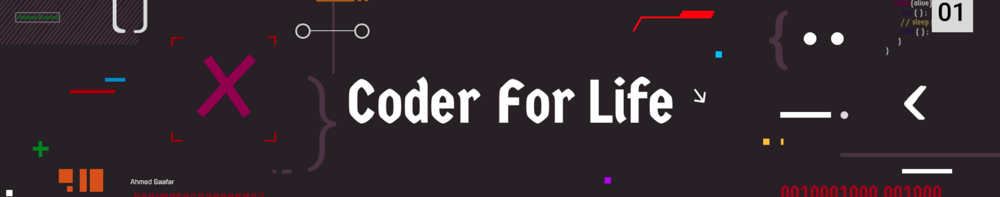

# MAD103-24F-008-DATA-FUNDAMENTALS-Fall-2024

## Course Overview
Welcome to MAD103-24F-008 Data Fundamentals for Fall 2024. This course will introduce you to the essential concepts and tools needed to understand and work with data effectively.

## Folder Structure
- `assets/`: Images and other media files
- `Lecture_Notes_In_LaTeX/`: Lecture notes in LaTeX format
- `Weeks/`: Weekly files containing course materials
- `Assignments/`: Assignment files and instructions
- `Zip/`: Zip files of the course.

### Course Outline
- [Course Outline](./Course%20Outline.pdf)

## Course Content

#### Course Syllabus: Data Fundamentals
NOTE: Please note this outline is a guide only. Changes from week to week may occur. You will be notified via your college email address of any changes.

- **Week 01**: Course Introduction – XML Documents
    - Assignment #1
    - Quiz #1
- **Week 02**: Working with Data – Introduction to JSON
    - Assignment #2
    - Quiz #2
- **Week 03**: Types of Information
    - Assignment #3
    - Quiz #3
- **Week 04**: TEST #1 (Covers week 1 - 3)
- **Week 05**: Data Definition Language – CREATE, ALTER, DROP
    - Assignment #4
    - Quiz #4
- **Week 06**: Data Manipulation Language – INSERT, UPDATE, DELETE
    - Assignment #5
    - Quiz #5
- **Week 07**: Data Manipulation Language – SELECT
    - Assignment #6
    - Quiz #6
- **Week 08**: Data Manipulation Language & Review– Working with Functions
    - Assignment #7
    - Quiz #7
- **Week 09**: Data Manipulation Language – Working with Aggregate Functions
    - Assignment #8
    - Quiz #8
- **Week 10**: TEST #2 (Covers week 4 - 8)
- **Week 11**: Data Manipulation Language – Working with Subsets of Information
    - Assignment #9
    - Quiz #9
- **Week 12**: Data Manipulation Language – Working with Multiple Tables
    - Assignment #10
    - Quiz #10
- **Week 13**: Normalization
    - Assignment #11
- **Week 14**: Entity Relationship Diagrams
    - Assignment #12
- **Week 15**: Test #3 (Covers week 9-14)

All assignments and quizzes must be submitted by the due dates. Late submissions will receive a mark of 0. These are individual assignments; no group work is allowed. Any matching assignments will receive a mark of 0 and be handled according to the Code of Student Rights and Responsibilities. The use of generative AI tools is strictly prohibited and considered Academic Misconduct.

### Assessment Totals:
- Assignments: 30%
- Test 1: 20%
- Test 2: 20%
- Test 3: 20%
- Quizzes: 10%

### Important Dates:
- September 3rd, 2024 - Semester starts
- September 16, 2024 - Last day to add/withdraw for the fall semester
- October 14th - Thanksgiving Holiday - College is Closed
- November 12, 2024 - 2/3rd drop date - last date to drop a class
- December 9th - 13th - Final Test Week

### Instructor Information
- A. Sodiq Shofoluwe
- Email: ashofoluwe@stclaircollege.ca

#### Office hours (Virtual):
- Monday 3:00pm - 4:00pm
- Thursday 3:00pm - 4:00pm

### Respondus LockDown Browser
- [LockDown Browser Requirement Instruction.docx](./LockDown%20Browser%20Requirement%20Instruction.docx) 

## Mini-FAQ
- **What textbook do I need?** There is no textbook for this course.
- **How do I contact my instructor?** Contact information is listed under the Course Information section of Blackboard.
- **Where can I find the Course Syllabus?** The current course syllabus can be found under Course Information.
- **Where is the Course Outline?** The course outline can be found under Course Information.
- **When are assignments due?** Due dates are posted in the MAD 103 Due Dates Calendar section in Blackboard.
- **Where do I go to participate in the live lecture?** Click on the Class Lecture Sessions link on Blackboard. Recordings can be found via the link in each week's folder.